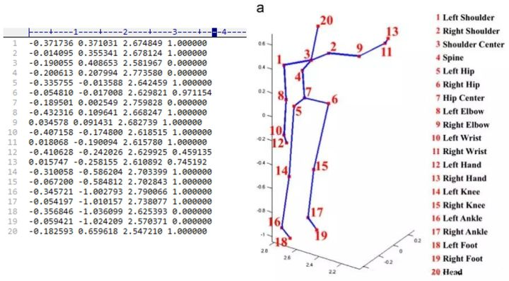

# MSR 3d Action Data Visualization

Used dataset: [MSRAction3DSkeletonReal3D.rar](https://uowmailedu-my.sharepoint.com/personal/wanqing_uow_edu_au/_layouts/15/onedrive.aspx?id=%2Fpersonal%2Fwanqing%5Fuow%5Fedu%5Fau%2FDocuments%2FResearchDatasets%2FMSRAction3D)


## Data Explanation

以文件a01_s01_e01_skeleton3D.txt为例进行说明。该文件共4列1080行。其中，每行存储着每帧骨架关键点的(x, y, z, c)的数据，其中(x,y,z)是以kinect为坐标原点的世界坐标系下的值，c是置信度得分。每个骨架共有20个关键点，因此该文件中共存储1080/20=54帧的关键点数据。骨架关键点的位置，以及第一帧的20个关键点数据如下图所示。

对应到正常坐标系下

和`matplolib`的`ax3d`对应关系:
$$X_{matplotlib} = Z_{msr}$$
$$Y_{matplotlib} = X_{msr}$$
$$Z_{matplotlib} = Y_{msr}$$

## Usage

``` python
python main.py ./msrData/xxxx.txt
```

